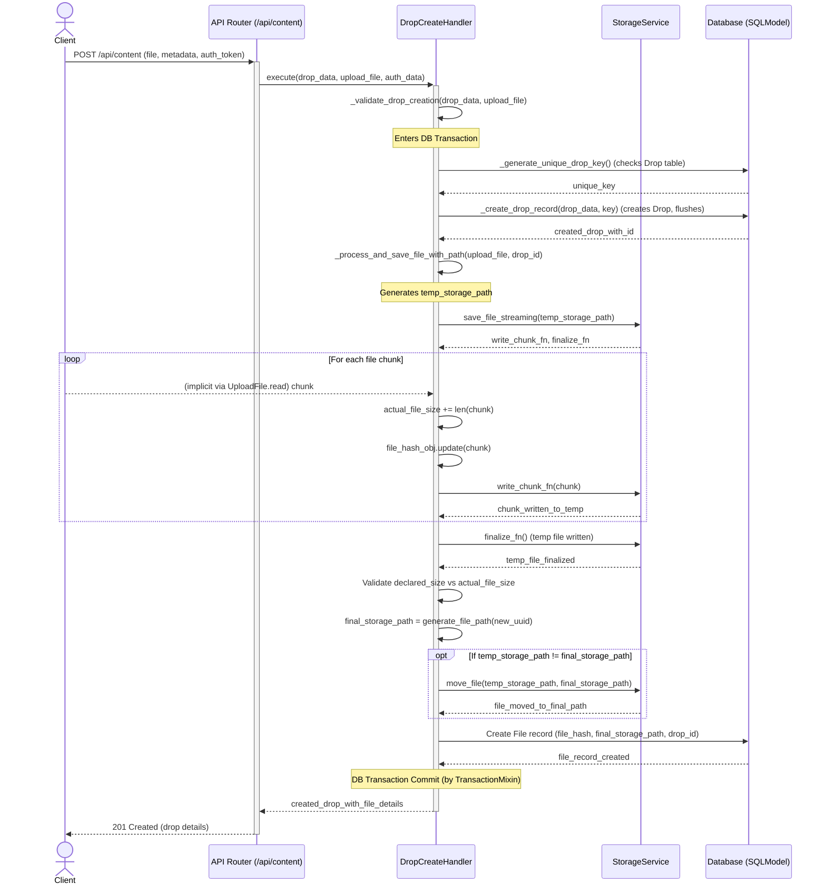
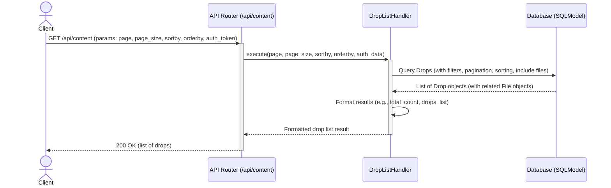
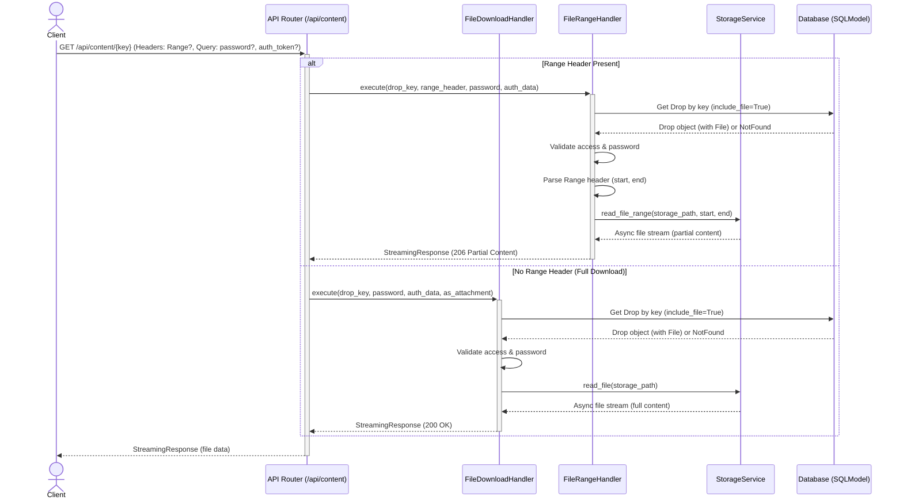

# API Endpoint List

## Drop API (Prefix: /api/content)

- `GET /api/content` - `list_drops`: Drop 목록 조회
- `GET /api/content/{key}/preview` - `get_drop_preview`: Drop 미리보기 정보 조회
- `GET /api/content/{key}` - `download_or_stream_file`: Drop 파일 다운로드/스트리밍
- `POST /api/content` - `create_drop`: 파일과 함께 Drop 생성
- `PATCH /api/content/{key}/detail` - `update_drop_detail`: Drop 상세정보 수정
- `PATCH /api/content/{key}/permission` - `update_drop_permission`: Drop 권한 수정
- `PATCH /api/content/{key}/password` - `update_drop_password`: Drop 패스워드 설정/변경
- `PATCH /api/content/{key}/reset` - `reset_drop_password`: Drop 패스워드 제거
- `PATCH /api/content/{key}/favorite` - `update_drop_favorite`: Drop 즐겨찾기 토글
- `DELETE /api/content/{key}` - `delete_drop`: Drop 삭제
- `GET /api/content/keycheck/{key}` - `check_key_availability`: 키 사용 가능 여부 확인

## Auth API (Prefix: /api/auth)

- `POST /api/auth/login` - `login`: 사용자 로그인
- `POST /api/auth/refresh` - `refresh_token`: 토큰 갱신
- `POST /api/auth/validate` - `validate_token`: 토큰 검증
- `GET /api/auth/logout` - `logout`: 로그아웃
- `GET /api/auth/me` - `get_current_user_info`: 현재 사용자 정보 조회

## API Key API (Prefix: /api/api-key)

- `POST /api/api-key` - `create_api_key`: 새 API Key 생성
- `GET /api/api-key` - `list_api_keys`: API Key 목록 조회
- `GET /api/api-key/{api_key_id}` - `get_api_key`: 특정 API Key 정보 조회
- `PATCH /api/api-key/{api_key_id}` - `update_api_key`: API Key 정보 수정
- `DELETE /api/api-key/{api_key_id}` - `delete_api_key`: API Key 삭제
- `POST /api/api-key/validate` - `validate_api_key`: API Key 검증
- `POST /api/api-key/{api_key_id}/deactivate` - `deactivate_api_key`: API Key 비활성화
- `POST /api/api-key/{api_key_id}/activate` - `activate_api_key`: API Key 활성화

## Drop API Sequence Diagrams

### 1. Create Drop (`POST /api/content`)



### 2. List Drops (`GET /api/content`)



### 3. Get Drop Preview (`GET /api/content/{key}/preview`)

```mermaid
sequenceDiagram
    actor Client
    participant Router as API Router (/api/content)
    participant Handler as DropDetailHandler
    participant DB as Database (SQLModel)

    Client->>+Router: GET /api/content/{key}/preview (params: password, auth_token?)
    Router->>+Handler: execute(drop_key, password, auth_data)
    Handler->>DB: Get Drop by key (include_file=True)
    DB-->>Handler: Drop object (with related File object) or NotFound
    alt Drop Found
        Handler->>Handler: Validate access (user_only, password)
        Handler-->>-Router: Drop object with File details
        Router-->>-Client: 200 OK (drop preview details)
    else Drop Not Found or Access Denied
        Handler-->>-Router: Raises DropNotFound / DropPasswordInvalid / DropAccessDenied
        Router-->>-Client: 404 / 401 / 403 Error
    end
```

### 4. Download/Stream File (`GET /api/content/{key}`)



### 5. Update Drop Detail (`PATCH /api/content/{key}/detail`)

```mermaid
sequenceDiagram
    actor Client
    participant Router as API Router (/api/content)
    participant AccessHandler as DropAccessHandler
    participant UpdateHandler as DropUpdateHandler
    participant DB as Database (SQLModel)

    Client->>+Router: PATCH /api/content/{key}/detail (data: title?, desc?, password?, auth_token)
    Router->>+AccessHandler: validate_access(drop_key, password, auth_data, require_auth=True)
    AccessHandler->>DB: Get Drop by key
    DB-->>AccessHandler: Drop object or NotFound
    AccessHandler->>AccessHandler: Validate access (user_only, password check if drop has one)
    alt Access Granted
        AccessHandler-->>Router: Access validated
        Router->>+UpdateHandler: execute(drop_key, update_data, auth_data)
        Note over UpdateHandler: Enters DB Transaction
        UpdateHandler->>DB: Get Drop by key
        DB-->>UpdateHandler: Drop object or NotFound
        UpdateHandler->>DB: Update Drop record (title, description, updated_at)
        Note over UpdateHandler: DB Transaction Commit
        DB-->>UpdateHandler: Updated Drop object
        UpdateHandler-->>-Router: Updated Drop object
        Router-->>-Client: 200 OK (updated drop details)
    else Access Denied / Drop Not Found
        AccessHandler-->>-Router: Raises DropNotFound / DropPasswordInvalid / DropAccessDenied
        Router-->>-Client: 404 / 401 / 403 Error
    end
```

### 6. Delete Drop (`DELETE /api/content/{key}`)

```mermaid
sequenceDiagram
    actor Client
    participant Router as API Router (/api/content)
    participant AccessHandler as DropAccessHandler
    participant DeleteHandler as DropDeleteHandler
    participant Storage as StorageService
    participant DB as Database (SQLModel)

    Client->>+Router: DELETE /api/content/{key} (Query: password?, auth_token)
    Router->>+AccessHandler: validate_access(drop_key, password, auth_data, require_auth=True)
    AccessHandler->>DB: Get Drop by key
    DB-->>AccessHandler: Drop object or NotFound
    AccessHandler->>AccessHandler: Validate access
    alt Access Granted
        AccessHandler-->>Router: Access validated
        Router->>+DeleteHandler: execute(drop_key, auth_data)
        Note over DeleteHandler: Enters DB Transaction
        DeleteHandler->>DB: Get Drop by key (include_file=True)
        DB-->>DeleteHandler: Drop object with File or NotFound
        opt Drop and File Found
            DeleteHandler->>Storage: delete_file(file.storage_path)
            Storage-->>DeleteHandler: File deleted from storage
            DeleteHandler->>DB: Delete File record
            DeleteHandler->>DB: Delete Drop record
        end
        Note over DeleteHandler: DB Transaction Commit
        DeleteHandler-->>-Router: Success message
        Router-->>-Client: 200 OK (or 204 No Content) (success message)
    else Access Denied / Drop Not Found
        AccessHandler-->>-Router: Raises DropNotFound / DropPasswordInvalid / DropAccessDenied
        Router-->>-Client: 404 / 401 / 403 Error
    end
```

## Auth API Sequence Diagrams

### 1. User Login (`POST /api/auth/login`)

```mermaid
sequenceDiagram
    actor Client
    participant Router as API Router (/api/auth)
    participant Handler as LoginHandler
    participant Settings as AppSettings
    participant Response as FastAPI_Response

    Client->>+Router: POST /api/auth/login (username, password)
    Router->>+Handler: execute(username, password)
    Handler->>Settings: Access JWT settings (secret, algorithm, expiry)
    Handler->>Handler: Verify user credentials (e.g., against configured admin user)
    alt Credentials Valid
        Handler->>Handler: Create access_token
        Handler->>Handler: Create refresh_token (optional, if enabled)
        Handler-->>Router: AuthTokenResult (access_token, refresh_token, expires_in)
        Router->>Response: set_cookie("access_token", httponly=True)
        opt refresh_token exists
            Router->>Response: set_cookie("refresh_token", httponly=True)
        end
        Router-->>-Client: 200 OK (AccessToken)
    else Credentials Invalid
        Handler-->>-Router: Raises AuthenticationError
        Router-->>-Client: 401 Unauthorized
    end
```

### 2. User Logout (`GET /api/auth/logout`)

```mermaid
sequenceDiagram
    actor Client
    participant Router as API Router (/api/auth)
    participant Dependencies as FastAPI_Dependencies (get_current_user)
    participant Response as FastAPI_Response

    Client->>+Router: GET /api/auth/logout (Cookie: access_token, refresh_token)
    Router->>Dependencies: get_current_user (validates token from cookie)
    Dependencies-->>Router: current_user_data
    alt User Authenticated
        Router->>Response: delete_cookie("access_token")
        Router->>Response: delete_cookie("refresh_token")
        Router-->>-Client: 200 OK (logout success message)
    else User Not Authenticated (or token invalid)
        Dependencies-->>Router: Raises HTTPException (401)
        Router-->>-Client: 401 Unauthorized
    end
```

### 3. User Refresh Token (`POST /api/auth/refresh`)

```mermaid
sequenceDiagram
    actor Client
    participant Router as API Router (/api/auth)
    participant Handler as TokenRefreshHandler
    participant Settings as AppSettings
    participant Response as FastAPI_Response

    Client->>+Router: POST /api/auth/refresh (JSON: refresh_token_value or from Cookie)
    Router->>+Handler: execute(refresh_token_value)
    Handler->>Settings: Access JWT settings (secret, algorithm, expiry)
    Handler->>Handler: Validate refresh_token (decode, check expiry, check if revoked in DB - if applicable)
    alt Refresh Token Valid
        Handler->>Handler: Create new access_token
        Handler->>Handler: Create new refresh_token (optional, if rotation enabled)
        Handler-->>Router: AuthTokenResult (new_access_token, new_refresh_token, expires_in)
        Router->>Response: set_cookie("access_token", httponly=True)
        opt New refresh_token exists
            Router->>Response: set_cookie("refresh_token", httponly=True)
        end
        Router-->>-Client: 200 OK (New AccessToken)
    else Refresh Token Invalid
        Handler-->>-Router: Raises AuthenticationError
        Router-->>-Client: 401 Unauthorized
    end
```

### 4. User Validate Token (`POST /api/auth/validate`)

```mermaid
sequenceDiagram
    actor Client
    participant Router as API Router (/api/auth)
    participant Handler as ValidateTokenHandler
    participant Settings as AppSettings
    participant Response as FastAPI_Response

    Client->>+Router: POST /api/auth/validate (Cookie: access_token)
    Router->>+Handler: execute(access_token)
    Handler->>Settings: Access JWT settings (secret, algorithm, expiry)
    Handler->>Handler: Verify access_token
    alt Token Valid
        Handler->>Handler: Token is valid
        Handler-->>Router: TokenValidationResult (valid)
        Router-->>-Client: 200 OK (Token Valid)
    else Token Invalid
        Handler-->>-Router: Raises AuthenticationError
        Router-->>-Client: 401 Unauthorized
    end
```

### 3. Get Current User Info (`GET /api/auth/me`)

```mermaid
sequenceDiagram
    actor Client
    participant Router as API Router (/api/auth)
    participant Dependencies as FastAPI_Dependencies (get_current_user)
    participant TokenValidateHandler as TokenValidateHandler
    participant Settings as AppSettings

    Client->>+Router: GET /api/auth/me (Cookie: access_token)
    Router->>Dependencies: get_current_user (token from cookie)
    Dependencies->>TokenValidateHandler: execute(token)
    TokenValidateHandler->>Settings: Access JWT settings
    TokenValidateHandler->>TokenValidateHandler: Decode and validate token
    alt Token Valid
        TokenValidateHandler-->>Dependencies: TokenPayload (user_id, username, etc.)
        Dependencies-->>Router: current_user_data (TokenPayload)
        Router->>Router: Format user_data for response
        Router-->>-Client: 200 OK (user information)
    else Token Invalid
        TokenValidateHandler-->>Dependencies: Raises AuthenticationError
        Dependencies-->>Router: Raises HTTPException (401)
        Router-->>-Client: 401 Unauthorized
    end
``` 